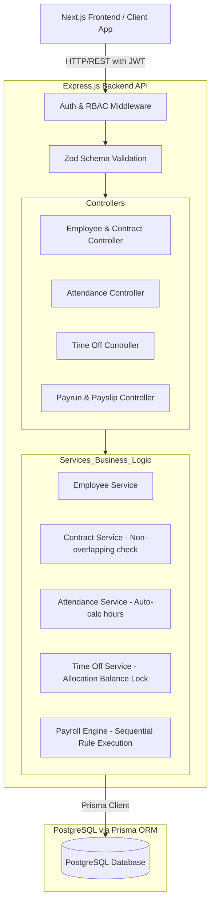
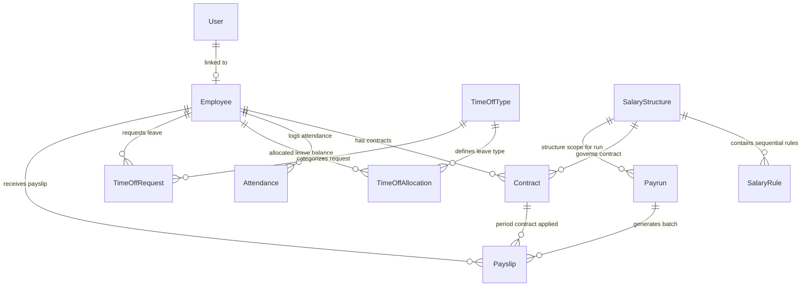

# PeoplePay360 System Architecture

## 1. Overview & Objectives

**PeoplePay360** is an enterprise-grade HR & Payroll management system designed to streamline employee lifecycle management, attendance tracking, time-off requests, and rule-driven payroll calculations.

This document serves as the single source of truth for the system architecture, domain boundary definitions, data relationships, and computation contracts across frontend, backend, and AI agents.

---

## 2. Technology Stack

- **Monorepo Architecture:** npm workspaces (`backend/`, `frontend/`, `e2e/`, `docs/`)
- **Backend API:** Node.js (v20+), Express.js, TypeScript
- **Database & ORM:** PostgreSQL 16+, Prisma ORM
- **Frontend Web App:** Next.js (App Router), TypeScript, Tailwind CSS, shadcn/ui
- **Authentication & RBAC:** JWT (Access Token in memory/cookie, Refresh Token in httpOnly cookie + DB storage)
- **Validation:** Zod for runtime schema validation on both API boundaries and forms
- **Testing:** Vitest (unit & business logic isolation), Supertest (API integration), Playwright (E2E)

---

## 3. High-Level System Architecture

---

## 4. Domain Models & Relational Architecture

### Key Entities & Rules:

1. **User & Roles**:
   - `EMPLOYEE` (`USER`): View own info, punch attendance, view balance & request time off.
   - `HR_MANAGER` (`ADMIN`): Manage employee master, contracts, attendance, approve/refuse time off.
   - `HR_PAYROLL_MANAGER` (`ADMIN`): Compute/validate/mark-paid payruns, manage salary structures & view company-wide payslips.

2. **Employee Master**:
   - Fields: Name, Email, Department, Job Position, Manager (Self-relation), Working Schedule (Standard 40h/week default), Status (`ACTIVE`, `INACTIVE`, `ON_LEAVE`), Bank Details (Account Number, Bank Name, Routing/IFSC).

3. **Contract (P0 Integrity Constraint)**:
   - Contains: `startDate`, `endDate` (nullable for indefinite), `wage` (monthly basic/base), `department`, `jobPosition`, `salaryStructureId`, `status` (`ACTIVE`, `DRAFT`, `CLOSED`).
   - **Crucial Invariant**: Only **ONE active contract** allowed for an employee covering any specific date range. Overlapping active contracts for the same employee must be rejected at the database/service layer.

4. **Attendance**:
   - Tracks `checkIn`, `checkOut`, auto-calculated `workedHours` (`Float`), and `status` (`PRESENT`, `ABSENT`, `HALF_DAY`).

5. **Time Off (Types, Allocations, Requests)**:
   - Pre-seeded Types: `Annual Leave`, `Sick Leave`, `Unpaid Leave`.
   - `TimeOffAllocation`: Total allocated days, used days, remaining days (`allocated - used`).
   - `TimeOffRequest`: `startDate`, `endDate`, `totalDays`, `status` (`PENDING`, `APPROVED`, `REJECTED`).
   - **Crucial Invariant**: Approving a request atomically increments `used` days and deducts remaining balance. Exceeding balance must fail with validation error.

6. **Salary Structure & Rule Computation Engine**:
   - Sequence of execution:
     1. `BASIC`: Base wage from the period's active contract.
     2. `ALLOWANCE`: Fixed or percentage-based allowances (e.g., HRA, Transport).
     3. `GROSS`: `BASIC + SUM(ALLOWANCES)`.
     4. `DEDUCTION`: Statutory/tax/unpaid leave deductions (e.g., PF, Tax, Unpaid leave deduction).
     5. `NET`: `GROSS - SUM(DEDUCTIONS)`.

7. **Payrun & Payslip**:
   - 2-step Payrun creation: Scope (Period + Salary Structure) -> Employee selection -> Batch generation.
   - States: `DRAFT` -> `COMPUTING` -> `VALIDATED` -> `PAID`.
   - Payslip: Captures exact line items, period contract snapshot, worked days, gross, and net pay.
   - **Pre-Payment Validation Warnings**: Flags employees with missing bank details, missing contracts in period, or negative net pay.

---

## 5. Scope Boundaries (24h Hackathon Lock)

| Priority | Feature Scope |
|---|---|
| **P0 (Must Work Live Demo)** | • Employee Master (Kanban / List / Form) • Contract with non-overlapping constraint • Attendance check-in/out with auto-hours • Time off request with automatic balance deduction on approval • Hardcoded Salary Rule Engine (Basic → Allowance → Gross → Deduction → Net) • Payrun 2-Step Wizard & Payrun processing (Compute, Validate, Mark Paid) • Payslip detail view with complete rule-driven breakdown |
| **P1 (Stretch Post-P0 Demo)** | • Payslip PDF generation (Print Payslip) • Bulk email distribution triggers • Payroll KPI cards (Total Net Paid, Payslips Generated, Avg Salary) • Manual attendance corrections |
| **CUT (Explicitly Excluded)** | • Custom schedule editor (all use default 40h standard) • Complex multi-tier RBAC beyond 3 roles • Contract versioning timeline UI • Dynamic Salary Rule builder UI (use fixed backend rules) • Multi-department nested analytics |
